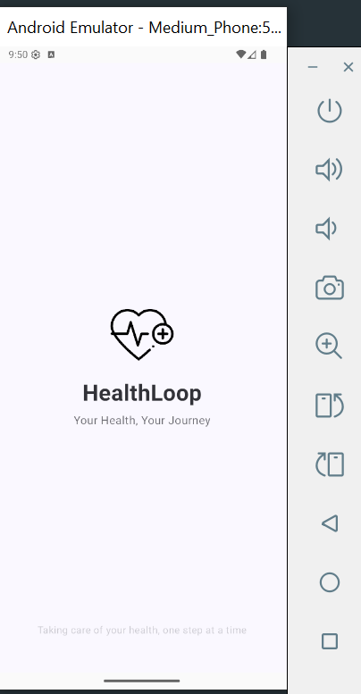

# HealthLoop

HealthLoop is a comprehensive health tracking Android application designed to help users monitor and improve their daily health habits. With an intuitive interface and powerful features, HealthLoop makes it easy to log health metrics, analyze trends, and stay motivated on your wellness journey.

## Features

- **Log Daily Health Metrics:** Record essential health data such as steps, calories, water intake, and more.
- **Dashboard Overview:** Get a quick summary of your daily and weekly health stats on a modern dashboard.
- **Detailed Analysis:** Visualize your progress with charts and graphs to identify trends and patterns.
- **History Tracking:** Access a complete history of your health entries for better long-term tracking.
- **Reminders:** Set up daily notifications to remind you to log your health data and stay consistent.
- **Customizable Settings:** Personalize your experience with adjustable settings and preferences.
- **Secure Local Storage:** All your health data is stored securely on your device.

## Screenshots

Add your app screenshots in the `screenshots/` folder and they will appear here:

### SplashScreen

### Dashboard

### History

### Add Entry Screen

### Analysis

### Setting

---

## Getting Started

1. Clone the repository.
2. Open the project in Android Studio.
3. Build and run the app on your device or emulator.

## Technologies Used
- Kotlin
- Jetpack Compose
- Room Database
- Clean Architecture

