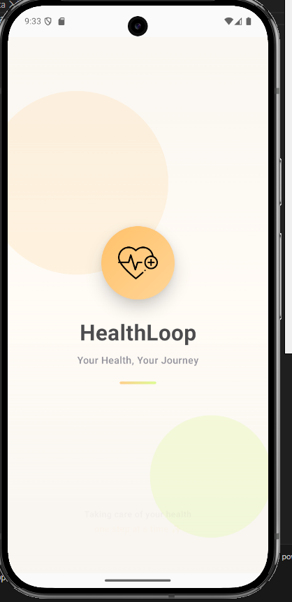
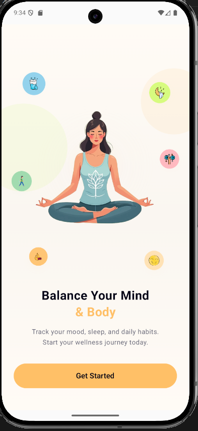
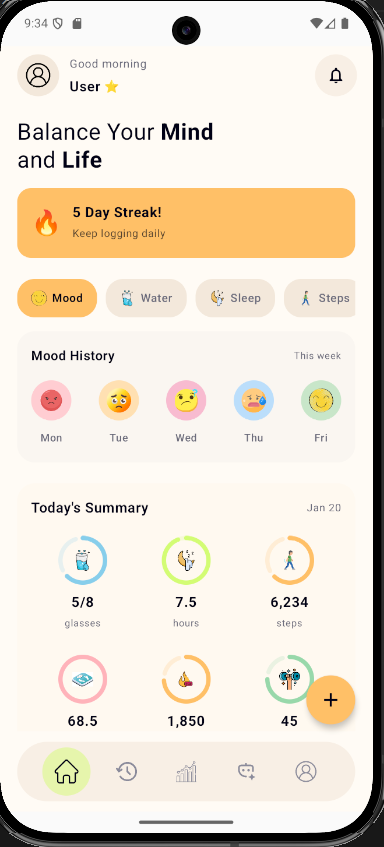
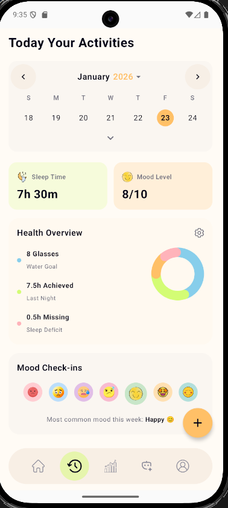
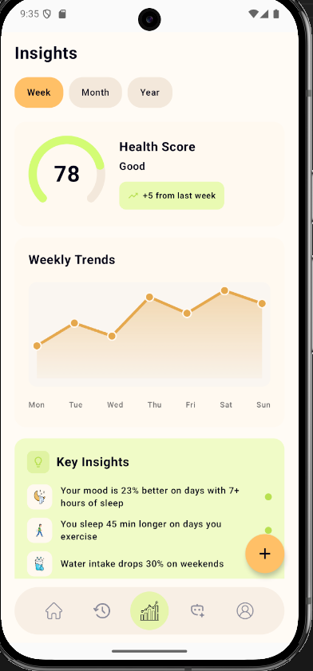
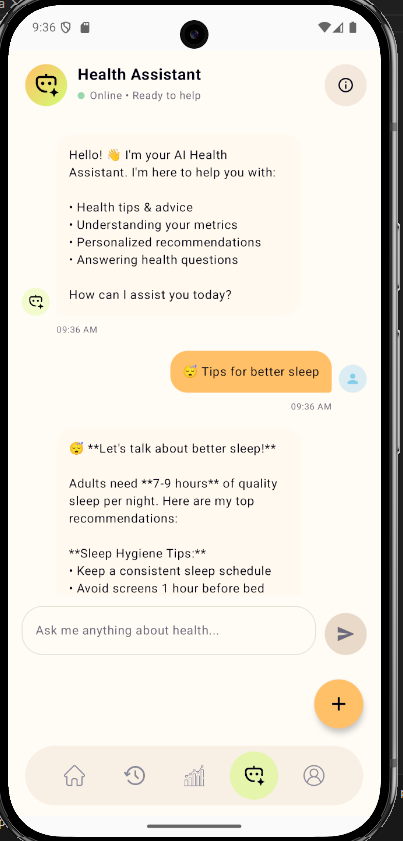
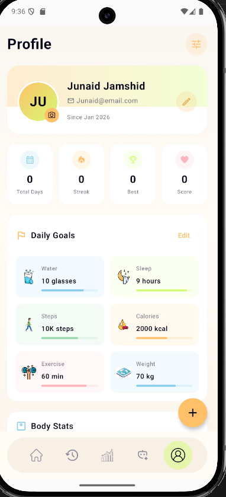
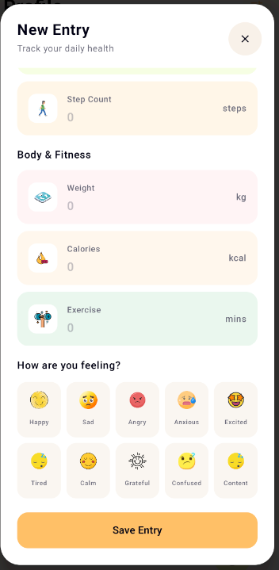
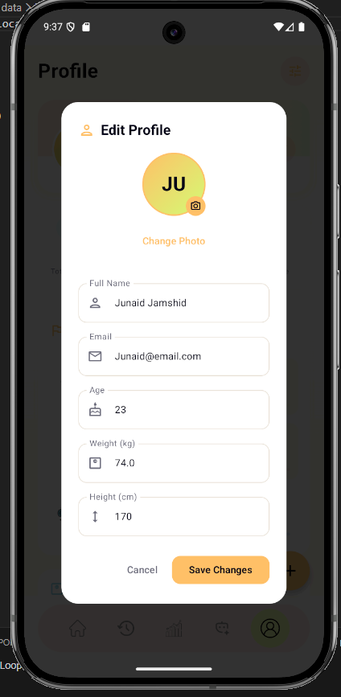

# 🏃‍♂️ HealthLoop

<p align="center">
  
</p>

<p align="center">
  <b>Your Personal Health Companion</b><br>
  A modern, feature-rich health tracking Android app built with Kotlin & Jetpack Compose
</p>

<p align="center">
  
  
  
  
</p>

---

## ✨ Features

### 📊 Comprehensive Health Tracking
- **Water Intake** - Track daily hydration with glass count
- **Sleep Hours** - Monitor sleep patterns and quality
- **Step Count** - Record daily steps towards your goal
- **Mood Tracking** - Log your emotional state with 8 mood options
- **Weight Management** - Track weight changes over time
- **Calorie Tracking** - Monitor daily calorie intake
- **Exercise Minutes** - Log workout duration

### 🤖 AI Health Assistant (Powered by Google Gemini)
- **Personalized Advice** - Get health recommendations based on YOUR actual data
- **Data-Aware Responses** - AI has access to your complete health profile, goals, and entries
- **Trend Analysis** - Ask about your health patterns and get intelligent insights
- **Conversation Memory** - Maintains context across chat sessions
- **Quick Suggestions** - Pre-built prompts for common health questions

### 📈 Smart Analytics & Insights
- **Health Score** - Dynamic score (0-100) calculated from your metrics
- **Weekly Trends** - Visual charts showing your progress
- **Goal Achievement** - Track how close you are to your targets
- **Mood Distribution** - Analyze emotional patterns over time
- **Sleep Quality Analysis** - Detailed sleep metrics and consistency scores
- **Key Insights** - AI-generated observations about your health patterns

### 📅 History & Calendar View
- **Calendar Navigation** - Browse entries by month/year
- **Daily Entry Cards** - Beautiful cards showing all logged metrics
- **Edit Past Entries** - Modify any historical entry
- **Search & Filter** - Find specific entries quickly

### 👤 User Profile & Goals
- **Customizable Profile** - Name, age, weight, height, profile picture
- **BMI Calculator** - Automatic BMI calculation with category
- **Personal Goals** - Set targets for water, sleep, steps, calories, exercise
- **Progress Tracking** - Monitor goal achievement percentages

### 🔔 Smart Reminders
- **Daily Notifications** - Customizable reminder times
- **Motivational Messages** - Encouraging notifications to stay consistent
- **Background Worker** - Reliable reminders even when app is closed

---

## 📱 Screenshots

<table>
  <tr>
    <td align="center"><b>Splash Screen</b></td>
    <td align="center"><b>Dashboard</b></td>
    <td align="center"><b>Add Entry</b></td>
  </tr>
  <tr>
    <td></td>
    <td></td>
    <td></td>
  </tr>
  <tr>
    <td align="center"><b>History</b></td>
    <td align="center"><b>Calendar View</b></td>
    <td align="center"><b>Insights</b></td>
  </tr>
  <tr>
    <td></td>
    <td></td>
    <td></td>
  </tr>
  <tr>
    <td align="center"><b>AI Assistant</b></td>
    <td align="center"><b>AI Chat</b></td>
    <td align="center"><b>Profile</b></td>
  </tr>
  <tr>
    <td></td>
    <td></td>
    <td></td>
  </tr>
</table>

---

## 🏗️ Architecture

HealthLoop follows **Clean Architecture** principles with **MVVM** pattern:

```
app/
├── data/
│   ├── local/          # Room Database, DAOs, Entities
│   ├── remote/         # Gemini API Service
│   ├── repository/     # Repository Implementations
│   └── mapper/         # Entity to Domain Mappers
├── domain/
│   ├── model/          # Domain Models
│   ├── repository/     # Repository Interfaces
│   └── usecase/        # Business Logic Use Cases
├── presentation/
│   ├── dashboard/      # Home Screen
│   ├── history/        # History & Calendar
│   ├── insights/       # Analytics Screen
│   ├── assistant/      # AI Chat Screen
│   ├── profile/        # User Profile
│   ├── components/     # Reusable UI Components
│   └── navigation/     # Bottom Navigation
├── di/                 # Hilt Dependency Injection
├── ui/theme/           # Material 3 Theming
├── util/               # Utilities
└── worker/             # WorkManager for Reminders
```

---

## 🛠️ Tech Stack

| Category | Technology |
|----------|------------|
| **Language** | Kotlin |
| **UI Framework** | Jetpack Compose |
| **Architecture** | Clean Architecture + MVVM |
| **Dependency Injection** | Hilt |
| **Local Database** | Room |
| **Networking** | Retrofit + OkHttp |
| **AI Integration** | Google Gemini API |
| **Async Operations** | Kotlin Coroutines + Flow |
| **Navigation** | Jetpack Navigation Compose |
| **Image Loading** | Coil |
| **Background Tasks** | WorkManager |
| **Charts** | Vico Charts |

---

## 🚀 Getting Started

### Prerequisites
- Android Studio Hedgehog or newer
- JDK 11+
- Android SDK 28+ (minSdk)
- Android SDK 35 (targetSdk)

### Installation

1. **Clone the repository**
   ```bash
   git clone https://github.com/yourusername/HealthLoop.git
   cd HealthLoop
   ```

2. **Open in Android Studio**
   - File → Open → Select the project folder

3. **Sync Gradle**
   - Wait for Gradle sync to complete

4. **Run the app**
   - Connect a device or start an emulator
   - Click Run ▶️

### API Configuration (Optional)
The AI Assistant uses Google Gemini API. The API key is pre-configured, but you can replace it:

1. Get your API key from [Google AI Studio](https://aistudio.google.com/)
2. Update the key in `AIAssistantRepositoryImpl.kt`:
   ```kotlin
   private const val API_KEY = "YOUR_API_KEY"
   ```

---

## 📂 Project Structure

```
HealthLoop/
├── app/
│   ├── src/
│   │   ├── main/
│   │   │   ├── java/com/example/healthloop/
│   │   │   ├── res/
│   │   │   └── AndroidManifest.xml
│   │   └── test/
│   └── build.gradle.kts
├── gradle/
│   └── libs.versions.toml
├── screenshots/
├── build.gradle.kts
├── settings.gradle.kts
└── README.md
```

---

## 🎨 UI/UX Design

- **Material Design 3** - Modern, clean aesthetic
- **Custom Color Palette** - Warm orange, soft green, sky blue theme
- **Smooth Animations** - Staggered animations, transitions
- **Responsive Layout** - Adapts to different screen sizes
- **Dark Mode Ready** - Theme infrastructure in place

---

## 📊 Database Schema

### Health Entry
| Field | Type | Description |
|-------|------|-------------|
| id | Long | Primary key |
| date | Date | Entry date |
| waterIntake | Int | Glasses of water |
| sleepHours | Float | Hours of sleep |
| stepCount | Int | Number of steps |
| mood | String | Mood state |
| weight | Float | Weight in kg |
| calories | Int | Calorie intake |
| exerciseMinutes | Int | Minutes exercised |

### User Profile
| Field | Type | Description |
|-------|------|-------------|
| id | Int | Primary key |
| name | String | User name |
| email | String | User email |
| age | Int | User age |
| weight | Float | Weight in kg |
| height | Int | Height in cm |
| profilePictureBase64 | String? | Profile image |

### User Goals
| Field | Type | Description |
|-------|------|-------------|
| id | Int | Primary key |
| waterGoal | Int | Daily water goal |
| sleepGoal | Float | Sleep hours goal |
| stepsGoal | Int | Daily steps goal |
| caloriesGoal | Int | Calorie goal |
| exerciseGoal | Int | Exercise minutes goal |
| weightGoal | Float | Target weight |

---

## 🤝 Contributing

Contributions are welcome! Please feel free to submit a Pull Request.

1. Fork the project
2. Create your feature branch (`git checkout -b feature/AmazingFeature`)
3. Commit your changes (`git commit -m 'Add some AmazingFeature'`)
4. Push to the branch (`git push origin feature/AmazingFeature`)
5. Open a Pull Request

---

## 📄 License

This project is licensed under the MIT License - see the [LICENSE](LICENSE) file for details.

---

## 👨‍💻 Author

**Junaid Jamshid**

- GitHub: [@junaidjamshid](https://github.com/junaidjamshid)

---

## 🙏 Acknowledgments

- [Jetpack Compose](https://developer.android.com/jetpack/compose) - Modern Android UI toolkit
- [Google Gemini](https://ai.google.dev/) - AI capabilities
- [Material Design 3](https://m3.material.io/) - Design system
- [Vico Charts](https://github.com/patrykandpatrick/vico) - Beautiful charts

---

<p align="center">
  Made with ❤️ for a healthier you
</p>


